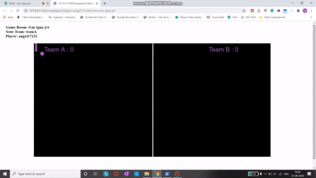
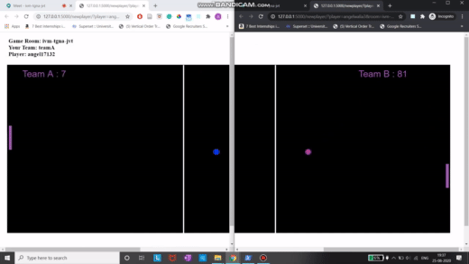

# Ponguin Meet: A Google Meet Extension to Play Pong
## Background
A Google Meet extension to play multiplayer pong with other participants in the meeting room while you wait for the meeting to start. The game is intended to act as an icebreaker for meetings.

## Deploying the game server
1. Download the sps2020-team80 repository on server.
2. Install the following requirements using `pip3 install`.
    - flask
    - flask-socketio
    - eventlet
3. Run `sudo python3 main.py`.
4. Visit: `server_ip/newgame`.
<hr>

## Game Play
The server hosts the game state that is synced between all the players for a given instance of the game.

- When first player joins \


- When multiple players join\

<hr>

## Troubleshooting
**Installing dependencies:**
In case downloading of the dependencies doesn't work or something breaks along the lines of `flask`, `flask-socketio` or `eventlet`. Try using the following -
```
$ python3 -m pip install flask
$ python3 -m pip install flask-socketio
$ python3 -m pip install eventlet
```
**Installing pip3:** If you happen to not have `pip3` use the following to install it and then follow the steps above to resolve the deopendencies.
```
$ wget https://bootstrap.pypa.io/get-pip.py -o get-pip.py
$ python3 get-pip.py
```
## Links
[Webapp](http://34.68.97.181/newplayer) | [Video](https://youtu.be/-HvZ-ABMN_Q) | [Design Doc](https://docs.google.com/document/d/1641ap_6jrd_O6O1aYaC8ZLNTEei5D3TVY7tPfCanNPg/edit?usp=sharing)

## Team Members
[Angel Walia](https://github.com/angelwalia3) | [Kanupriya Singh](https://github.com/kanupriyaa) | [Nitish Bharti](https://github.com/nitishbharti235) | [Priya Kaushal](https://github.com/Priyak5) | [Piyush Itankar](https://github.com/pitankar)
